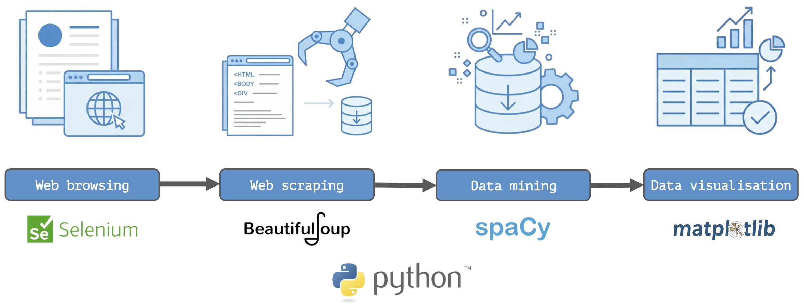

# ScholarPy

**Extract, analyse, and visualise research insights from scholarly profiles with web scraping and data mining in Python.**

---

## Overview

ScholarPy is a Python toolkit for extracting relevant data, analysing textual information, and visualising research insights from public scholarly profiles, such as ORCID and CienciaVitae. It integrates **web browsing**, **web scraping**, **data mining**, and **data visualisation** using various Python libraries to provide meaningful insights into the research activities and outputs of individual researchers or research teams.

The toolkit offers a collection of modular tools to:

* Discover public scholarly profiles on institutional webpages.
* Extract relevant data from public scholarly profiles (currently supporting ORCID and CienciaVitae).
* Analyse textual information using **natural language processing (NLP)**.
* Visualise research insights through meaningful infographic representations.

<br>



---

## Concepts

ScholarPy is built upon two core concepts:

- **Web scraping**: The process of automatically extracting data from websites. ScholarPy uses scraping to collect scholarly information from dynamic sources such as ORCID and CiênciaVitae profiles.  

- **Data mining**: The practice of analysing large sets of text or structured data to uncover patterns, trends, and insights. In ScholarPy, it transforms raw profile data into meaningful research indicators. 

---

## Features

This Python toolkit is based on advanced data processing and artificial intelligence modules:

* **Selenium**: Automates web browsing tasks, allowing scripts to interact with dynamically generated content and enabling the extraction of data even when the content is loaded asynchronously with JavaScript. Essential for accessing public scholarly CV pages.

* **BeautifulSoup**: Parses and navigates the HTML/XML content retrieved from webpages. It converts raw HTML/XML into a tree structure, allowing selective extraction of data of interest, such as tags, attributes, and text with high precision and efficiency.

* **SpaCy**: A state-of-the-art natural language processing (NLP) library. It supports tokenisation, lemmatisation, part-of-speech tagging, and stopword filtering in multiple languages (including English and Portuguese), making it ideal for processing scholarly texts.

* **Matplotlib**: A comprehensive data visualisation library. It provides tools to generate static and interactive plots, enabling the creation of custom graphs, trend plots, and word clouds that highlight the most relevant research insights from research profiles.

---

## Requirements

ScholarPy requires **Python 3.10+** and the following modules:

* [Selenium](https://pypi.org/project/selenium/).
* [BeautifulSoup4](https://pypi.org/project/beautifulsoup4/). 
* [lxml](https://pypi.org/project/lxml/).
* [spaCy](https://spacy.io/).
  * (Required) English model (`en_core_web_sm`).
  * (Optional) Portuguese model (`pt_core_news_sm`).  
* [Matplotlib](https://pypi.org/project/matplotlib/). 
* [WordCloud](https://pypi.org/project/wordcloud/).

---

## Installation

1. Clone the repository:

```bash
git clone https://github.com/ricardodpcosta/ScholarPy.git
cd ScholarPy
````

2. Install required packages via [pip](https://pypi.org/project/pip/) (package installer for Python):

```bash
pip install -r requirements.txt
```

3. Download the spaCy language models (English required, Portuguese optional):

```bash
python -m spacy download en_core_web_sm
python -m spacy download pt_core_news_sm
```

---

## Structure

```
ScholarPy/
│
├─ scripts/                 # Python scripts included in the toolkit
│   ├─ search_links.py      # Search public scholarly CV links from HTML or URLs
│   ├─ extract_data.py      # Scrape data from public scholarly CV pages
│   ├─ process_words.py     # Process text, lemmatise, filter stopwords, count words
│   └─ plot_wordcloud.py    # Generate word cloud visualisations from processed words
│
├─ examples/                # Example cases with running scripts
│
├─ requirements.txt         # Python dependencies for installation
├─ README.md                # Project overview, installation, usage instructions
└─ LICENSE                  # License file (MIT)

```

---

## Workflow

1. Run `search_links.py` to collect public scholarly CV links (currently supporting **ORCID** and **CienciaVitae**).

   * If you already have a prepared list of links, skip this step and proceed directly to **Step 2**.
   * The input can be a single link (for individual analysis) or a list of links (for group/collective analysis).

2. Run `extract_data.py` to scrape relevant textual data from the retrieved scholarly CV pages.

3. Perform various analyses of the extracted text data using the available tools (currently `analyse_words.py`).

4. Generate various data visualisations using the available tools (currently `plot_wordcloud.py`).

---

## Contributing

Contributions are encouraged in all forms, including the addition of new tools, refinement of existing scripts, enhancement of documentation, and resolution of issues.
For detailed guidelines, refer to [CONTRIBUTING.md](CONTRIBUTING.md).

---

## License

This project is licensed under the MIT License — see [LICENSE](LICENSE) for details.

---

## Contact

📧 [Ricardo Costa](mailto:rcosta\@dep.uminho.pt)  
🌐 [Academic page](https://ricardodpcosta.github.io/)
